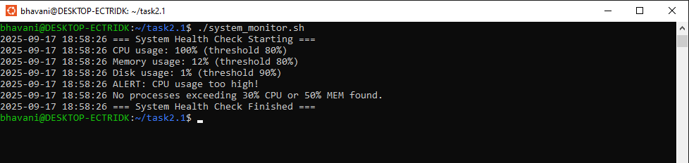

# System Health Monitoring Script

A simple **Linux system monitoring script** that checks system health by tracking:

- **CPU usage**
- **Memory usage**
- **Disk space**
- **Running processes**

If any metric exceeds predefined thresholds, the script logs an alert message to the console (and optionally to a log file).

---

## 🚀 Features
- Monitors **CPU, memory, disk usage, and processes** in real time.
- Configurable **thresholds** (e.g., CPU > 80%, Memory > 80%).
- Logs alerts when thresholds are crossed.
- Lightweight and easy to run.

---

## ⚙️ Prerequisites
- Linux/Unix environment
- `bash` or `sh` shell
- Standard utilities like `top`, `free`, `df`, and `ps`

---

## 📥 Installation
Clone the repository:
```bash
git clone https://github.com/Bhavani2909/Task2.1-SystemHealthMonitor.git
cd system-health-monitor
```

---

## ▶️ Usage
Run the script:
```bash
./system_monitor.sh
```

You may need to make it executable first:
```bash
chmod +x system_monitor.sh
```

---

## 📝 Example Output
```
[INFO] CPU Usage: 23%
[INFO] Memory Usage: 56%
[WARNING] Disk Usage: 82% - Above threshold!
[INFO] Top 5 processes:
   PID  USER   %CPU  %MEM  COMMAND
   234  root   12.0   5.0  java
   567  user    8.0   3.0  python
```

---

## ⚡ Configuration
Inside the script, you can set your own thresholds:
```bash
CPU_THRESHOLD=80
MEM_THRESHOLD=80
DISK_THRESHOLD=80
```

---

## 📂 File Structure
```
system-health-monitor/
│── system_monitor.sh   # Main script
│── README.md                  # Documentation
│── logs/                      # (Optional) Log files
```

---

## 📌 Future Improvements
- Email/SMS alerts
- Cron job integration for scheduled monitoring
- Export reports in JSON/CSV

---
## 📷 Screenshots

### ✅ Normal Run (System OK)


### ⚠️ Alert Run (Threshold Exceeded)


### ⚠️ Alert Run (Threshold Exceeded)


### 📝 Log File Entries


### ⏰ Cron Job Setup


---

## 👤 Author
- **Bhavani R**  
- GitHub: https://github.com/Bhavani2909

---

## 📜 License
This project is licensed under the MIT License.

